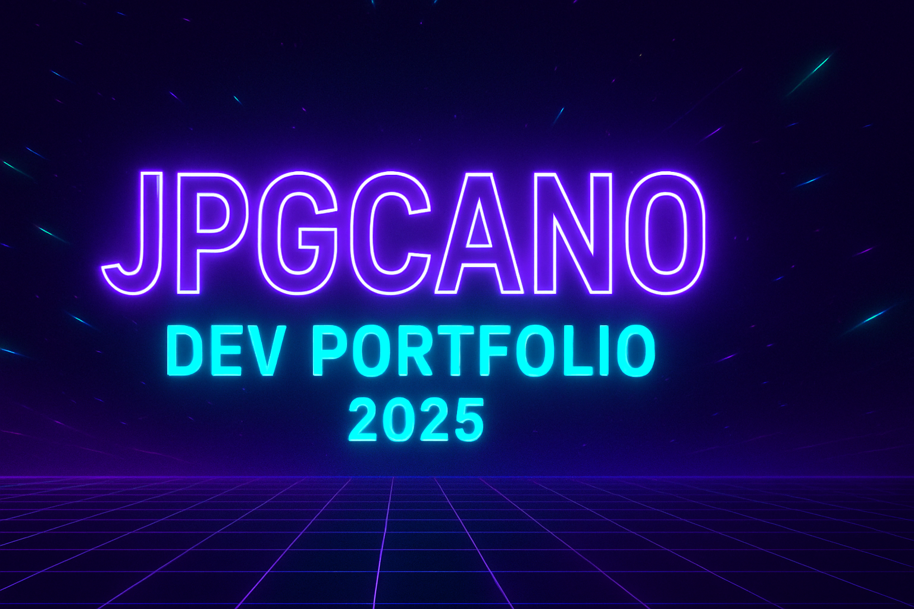

  <!-- Banner -->
  

# 👋 Hola, soy **JPGCANO**

**Analista de Sistemas • Desarrollador Full Stack • Automatización RPA**

---

## 💼 Sobre mí  
Tecnólogo en análisis y desarrollo de sistemas con experiencia en soporte técnico, redes y automatización. Me apasiona construir soluciones eficientes, limpias y modernas.

---

## 🛠️ Stack Técnico  

  
  
  
  
  
  

---

---

## 📅 Mi Trayectoria  
- **2021**: IA & Python (SENA + Everis)  
- **2022**: Bootcamps Azure, SQL y Ciberseguridad  
- **2022**: Practicante Desarrollador – San Vicente de Paul  
- **2023**: Auxiliar de Sistemas – San Juan de Dios  
- **2024**: RPA + Desarrollo Full Stack  
- **2025**: Portafolio Profesional

---

## 💡 Habilidades  
- Pensamiento Analítico  
- Orientación al Logro  
- Atención al Detalle  
- Trabajo en Equipo  
- Aprendizaje Continuo  

---

## 📊 Estadísticas  

  
  

---

## 📬 Contáctame  
[LinkedIn](https://www.linkedin.com/in/juancanogallo) • [Email](mailto:jpgcano1@gmail.com) • [Portafolio](https://jpgcano.com)

---

**“Código claro, ideas poderosas, resultados reales.”**

